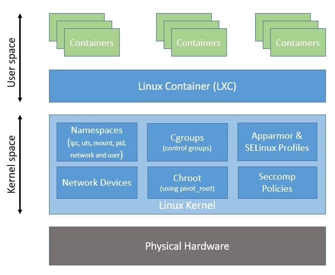
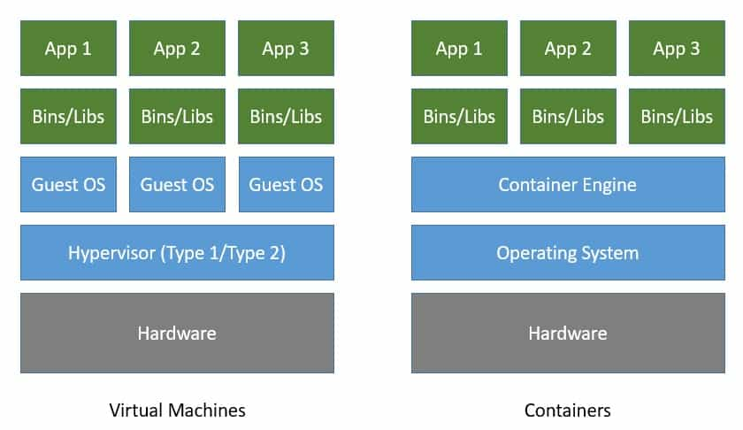
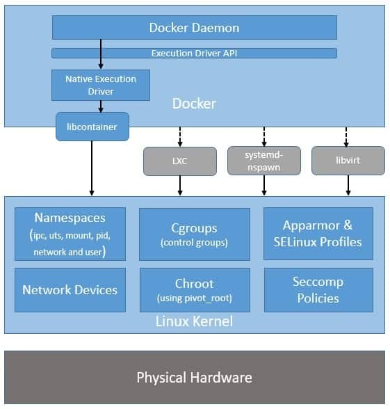
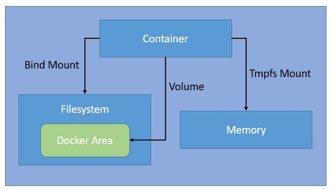

# inception
---
## Table of content


# Table of Contents

1. [Virtualization](#virtualization)
2. [What is a Virtual Machine](#what-is-a-virtual-machine)
3. [Hypervisor](#hypervisor)
4. [From chroot to container](#from-chroot-to-container)
5. [Containers](#containers)
   - [Container Overview](#container-overview)
6. [Dive into Containers](#dive-into-containers)
   - [Namespaces](#namespaces)
   - [Cgroups](#cgroups)
   - [Capabilities](#capabilities)
7. [Difference Between Hypervisor and Namespaces](#difference-between-hypervisor-and-namespaces)
8. [Containers vs VMs](#containers-vs-vms)
9. [Introduction to Docker](#introduction-to-docker)
   - [What Docker Offers](#what-docker-offers)
   - [Docker vs. Containerization Methods Before Docker](#docker-vs-containerization-methods-before-docker)
10. [Docker Ecosystem](#docker-ecosystem)
11. [Key Docker Technologies](#key-docker-technologies)
12. [Docker Image](#docker-image)
   - [Example of a Dockerfile](#example-of-a-dockerfile)
   - [How to Build and Run the Portainer Docker Image](#how-to-build-and-run-the-portainer-docker-image)
13. [Docker Compose](#docker-compose)
   - [Example docker-compose.yml](#example-docker-composeyml)
   - [Commands](#commands)
14. [Docker Volumes](#docker-volumes)
   - [Types of Docker Volumes](#types-of-docker-volumes)
   - [Creating and Using Docker Volumes](#creating-and-using-docker-volumes)
   - [Key Benefits of Docker Volumes](#key-benefits-of-docker-volumes)
15. [Docker Networks](#docker-networks)
   - [Types of Docker Networks](#types-of-docker-networks)
   - [Creating and Managing Networks with Docker CLI](#creating-and-managing-networks-with-docker-cli)


<!-- curl --ftp-ssl -k -u sabat ftp://vsftpd/ -->
---
## Virtualization

`Virtualization` uses software to create an abstraction layer over computer hardware, enabling the division of a single computer's hardware components—such as processors, memory and storage—into multiple virtual machines (VMs). Each VM runs its own operating system (OS) and behaves like an independent computer, even though it is running on just a portion of the actual underlying computer hardware.

It follows that virtualization enables more efficient use of physical computer hardware and allows a greater return on an organization’s hardware investment.

Today, virtualization is a standard practice in enterprise IT architecture. It is also the technology that drives cloud computing economics. Virtualization enables cloud providers to serve users with their existing physical computer hardware. It enables cloud users to purchase only the computing resources they need when they need it, and to scale those resources cost-effectively as their workloads grow.

## What is a Virtual Machine

A `virtual machine` (VM) is a software-based emulation of a physical computer that runs an operating system and applications just like a physical computer. VMs are created using virtualization software and have their own virtual hardware, including CPUs, memory, storage, and network interfaces.


## Hypervisor

The `hypervisor`, or virtual machine monitor (VMM), is the software layer that enables virtualization. It manages the creation, execution, and termination of VMs. There are two types of hypervisors:
- Type 1 (Bare-Metal): Runs directly on the host's hardware (e.g., VMware ESXi, Microsoft Hyper-V).
- Type 2 (Hosted): Runs on top of a host operating system (e.g., VMware Workstation, Oracle VirtualBox).


## From chroot to container

- During the development of Unix V7 in 1979, the chroot system call was introduced, changing the root directory of a process and its children to a new location in the filesystem. This advance was the beginning of process isolation: segregating file access for each process.

**revolution:**
Chroot introduced process isolation, allowing changes to the root directory of processes.
FreeBSD Jails enabled partitioning systems into isolated environments with individual IP addresses.
Linux VServer provided operating system-level virtualization for resource partitioning.
Process Containers evolved into cgroups for resource management and isolation in Linux.
Docker popularized containerization with an ecosystem for container management.
## Containers


<div align="center"></div>

 **Container overview**

Containers are packages of software that contain all of the necessary elements to run in any environment. In this way, containers virtualize the operating system and run anywhere, from a private data center to the public cloud or even on a developer’s personal laptop. 

**key features :**

- A container is a lightweight, standalone, and executable software package that includes everything needed to run a piece of software, including the code, a runtime, libraries, environment variables, and config files.

- Containers provide a consistent and reproducible environment, which makes it easier to develop, test, and deploy applications across different environments and platforms.

- Containers are isolated from each other and from the host system. Each container runs in its own namespace, which means it has its own view of the operating system, processes, file system, network, and mounted volumes.

- Containers use the host system's kernel and resources, but they do not require a full operating system per application like virtual machines do. This makes them more lightweight and efficient than virtual machines.

- Containers can be managed by container orchestration tools like Kubernetes, which handle deployment, scaling, networking, and availability of containers.

- The concept of a container as an isolated running process is fundamental to container technologies like Docker, LXC, and others.

### **Dive into containers**
 **Namespaces**

In the context of containers, a namespace is a technology that provides isolation for running processes. Each aspect of a container runs in a separate namespace and its access is limited to that namespace. 

Namespaces are a feature of the Linux kernel that partitions kernel resources such that one set of processes sees one set of resources while another set of processes sees a different set of resources. The feature works by having the same namespace for a set of resources and processes, but those namespaces refer to distinct resources. 

Resources may be various aspects of a system like network access, process IDs, user IDs, and filesystems. 

For example, the PID namespace isolates the process ID number space, meaning that processes in different PID namespaces can have the same PID. Or, the network namespace isolates network interfaces, so containers can have their own virtual network interfaces and IP addresses.

Namespaces provide the isolation that makes containers possible, so each container can run its own isolated processes, have its own network configuration, its own users, and its own filesystem.

 **Cgroups**

Control groups, or cgroups, are a critical feature of the Linux kernel that Docker uses to manage and limit the resources used by containers. Cgroups provide fine-grained control over the allocation and usage of system resources such as CPU, memory, disk I/O, and network bandwidth. Here’s how Docker utilizes cgroups:

- CPU Management: Docker can limit the CPU usage of a container by setting cgroup constraints, ensuring no single container can monopolize the CPU and allowing fair distribution of CPU resources among multiple containers.
- Memory Management: Cgroups allow Docker to set memory usage limits for containers. If a container exceeds its allocated memory, it can be restricted or terminated, preventing it from affecting the stability of the host system.
- Block I/O Management: Docker can control the disk I/O bandwidth available to a container, preventing I/O-intensive containers from degrading the performance of other containers or the host system.
Network Bandwidth Management: Cgroups can also limit the network bandwidth available to a container, ensuring that network resources are fairly shared among containers.

#### **Capabilities**

Provides fine-grained control over process privileges, allowing containers to run with only the necessary privileges.

---

## Diff between hypervisor and namspaces
| Feature                | Hypervisor                                         | Namespace                                        |
|------------------------|----------------------------------------------------|--------------------------------------------------|
| **Definition**         | Software that creates and runs virtual machines   | Linux kernel feature for isolating resources    |
| **Purpose**            | Allows multiple operating systems to share a single hardware host | Isolates and partitions kernel resources for processes |
| **Resource Isolation** | Virtualizes hardware resources (CPU, memory, etc.) | Partitions kernel resources (processes, files, etc.) |
| **Kernel**             | Each VM has its own guest OS and kernel            | Shares the host system's kernel                  |
| **Hardware Virtualization** | Provides virtual hardware (e.g., virtual CPUs, disks) | No hardware virtualization; operates at process level |
| **Use Case**           | Running multiple OS environments on a single host | Creating isolated application environments in containers |
| **Examples**           | VMware, Hyper-V, KVM                              | PID namespace, NET namespace, IPC namespace     |
| **Resource Management**| Allocates physical resources to virtual machines   | Manages process-level resources and isolation    |
| **Isolation Level**    | Hardware-level isolation                           | Kernel-level isolation                           |
| **Overhead**           | Higher (requires full OS for each VM)              | Lower (shares host OS and resources)            |


In summary, hypervisors provide full virtualization with separate guest operating systems, while namespaces offer process-level isolation within a single host OS, making them suitable for different use cases and providing different types of resource management and isolation.
---
## Container Vs VMs 

| Feature                | Containers                                    | Virtual Machines                              |
|------------------------|-----------------------------------------------|-----------------------------------------------|
| **Architecture**       | Shares the host OS kernel                     | Runs a full guest OS with a hypervisor        |
| **Isolation**          | Process-level isolation                       | Hardware-level isolation                      |
| **Boot Time**          | Fast (seconds)                                | Slower (minutes)                              |
| **Resource Overhead**  | Low (shares OS resources)                     | High (dedicated OS and resources)             |
| **Efficiency**         | High (lightweight)                            | Lower (heavier)                               |
| **Scalability**        | Very high (more containers per host)          | Lower (fewer VMs per host)                    |
| **Portability**        | Highly portable (consistent environment)      | Portable but more complex (full OS migration) |
| **Use Cases**          | Microservices, DevOps, CI/CD, cloud-native apps| Traditional applications, legacy systems, OS diversity |
| **Security**           | Moderate (depends on host OS security)        | Strong (hardware-level isolation)             |
| **Management**         | Easier to manage and orchestrate              | More complex management                       |
| **Storage**            | Layered filesystem (e.g., OverlayFS)          | Dedicated virtual disks                       |
| **Networking**         | Uses host network or overlay networks         | Virtual network interfaces                    |
| **Examples**           | Docker, Kubernetes, LXC                       | VMware, Hyper-V, KVM                          |

<div align="center"></div>

---
## Introduction to Docker

<div align="center"></div>
Docker is a platform that revolutionizes how applications are developed, deployed, and run by leveraging containerization technology. Containers encapsulate an application and its dependencies into a single, portable unit, ensuring consistent performance across different environments. Docker simplifies the process of creating, deploying, and managing containers, making it easier to develop, ship, and run applications reliably.

### What Docker Offers

Docker builds upon the fundamental concepts of containerization and introduces several key innovations and improvements:

1. **User-Friendly Tools**:
   - Docker provides an intuitive command-line interface (CLI) and graphical tools that simplify container management tasks, from building and running containers to orchestrating multi-container applications.

2. **Efficient Image Management**:
   - Docker uses a layered image format that enables efficient storage and distribution of container images. Images can be versioned, shared via Docker Hub, and reused across different environments.

3. **Enhanced Orchestration**:
   - Docker Compose and Docker Swarm facilitate the management of multi-container applications, while Docker's integration with Kubernetes provides advanced orchestration capabilities for complex, production-grade deployments.

4. **Improved Security**:
   - Docker includes security features such as Docker Content Trust, security scanning, and runtime security controls to help protect containerized applications.

5. **Developer Productivity**:
   - Docker's automation tools, such as Dockerfile for image building and Docker Hub for image distribution, streamline development workflows and foster collaboration.

6. **Flexible Networking**:
   - Docker offers various networking options, including bridge, host, and overlay networks, to manage container communication and connectivity effectively.

7. **Active Ecosystem**:
   - Docker has a vibrant community and extensive ecosystem, providing access to a wealth of resources, tools, and integrations.
---
### Docker vs. Containerization Methods Before Docker

| Feature                | Docker                                             | Pre-Docker Containerization Methods                    |
|------------------------|----------------------------------------------------|--------------------------------------------------------|
| **Ease of Use**        | Intuitive CLI and GUI tools                       | More manual setup and management                      |
| **Image Management**   | Layered images with versioning and Docker Hub     | Limited image management and sharing options          |
| **Orchestration**      | Docker Compose, Docker Swarm, Kubernetes integration | Less integrated orchestration tools                   |
| **Security**           | Built-in security features and integrations       | Less standardized security controls                    |
| **Developer Tools**    | Dockerfile for automation, rich ecosystem          | More manual and disparate tooling                      |
| **Networking**         | Advanced networking options (bridge, host, overlay) | Basic networking setups                               |
| **Community**          | Large, active community and ecosystem              | Smaller, less integrated communities                   |


Sure! Here’s the revised content with the Docker ecosystem described in text and key Docker technologies presented in a table:

---

## Docker Ecosystem

Docker provides a comprehensive ecosystem to simplify container management and application development. Here’s an overview:

- **Docker Desktop** offers a user-friendly interface that makes it easy to build, run, and manage containers. It's designed to simplify the development workflow with intuitive tools.
  
- **Docker Engine** is the core runtime that delivers a lightweight and secure environment for running containers. It is included with Docker Desktop and manages the execution of containerized applications.

- **Docker Scout** provides near real-time actionable insights to secure and manage the software supply chain, enhancing the oversight and protection of containerized applications.

- **Docker Hub** is the largest and most widely used image repository. It serves as the primary container registry for developers to share, manage, and securely store their containerized applications.

- **Docker Build Cloud** is a premium service that optimizes the image-building process, particularly in enterprise environments, to enhance efficiency and performance.
---
## Key Docker Technologies

<div align="center"></div>


| **Technology**       | **Description**                                                                                         |
|----------------------|---------------------------------------------------------------------------------------------------------|
| **Runtime**          | Manages the execution and isolation of containers, ensuring they run as independent, lightweight units. |
| **Daemon**           | The core service that runs in the background, handling Docker objects like containers, images, and volumes. |
| **Orchestrator**     | Tools like Docker Swarm and Kubernetes manage and coordinate the deployment, scaling, and operations of containers across multiple hosts. |
| **CLI (Command Line Interface)** | Provides a command-line tool to interact with the Docker daemon, allowing users to manage containers, images, networks, and volumes. |
| **Builder**          | Creates Docker images from Dockerfiles, packaging applications and dependencies into portable formats. |
| **Registry**         | A system for storing and distributing Docker images, with Docker Hub being the most well-known public registry, along with private registries. |
---
## Docker Image

`Docker images` are essential blueprints for creating containers, encapsulating all necessary components to run an application. These images utilize a layered architecture for efficient storage and reuse, and once created, remain immutable to preserve consistency. 

Docker images can be versioned with tags, ensuring easy management of different iterations. Their portable nature allows for consistent deployment across various Docker-supported environments, promoting reusability in different projects. Images are defined by **Dockerfiles**, which specify build instructions and configurations. This approach enables streamlined development and deployment processes. Docker images are typically stored in registries like Docker Hub or private repositories, facilitating easy sharing and distribution within development teams or across organizations.


#### **Example of a Dockerfile**

Here's a simple example  demonstrates how to create a Docker image using a `Dockerfile` based on the Debian bullseye image. The image installs necessary packages, downloads and extracts Portainer, and sets up a Python script.

```dockerfile
# Use Debian Bullseye as the base image
FROM debian:bullseye

# Update the package list, install curl and python3, and clean up to reduce image size
RUN apt-get update && \                             # Update the list of available packages
    apt-get install -y curl python3 && \            # Install curl and python3 without prompting for confirmation
    apt-get clean && \                             # Remove temporary files used during package installation
    rm -rf /var/lib/apt/lists/*                     # Remove cached package lists to reduce image size

# Download and extract Portainer
RUN curl -L https://github.com/portainer/portainer/releases/download/2.19.5/portainer-2.19.5-linux-amd64.tar.gz -o portainer.tar.gz && \  # Download Portainer release
    tar -xzvf portainer.tar.gz && \                # Extract the downloaded Portainer archive
    rm portainer.tar.gz                            # Remove the Portainer archive file to save space

# Copy the Python script from the host into the container's root directory
COPY ./tools/script.py /                          # Copy script.py from the local 'tools' directory to the root directory of the container

# Expose port 2307 to allow communication to and from the container
EXPOSE 2307                                      # Inform Docker that the container listens on port 2307

# Define the command to execute when the container starts
CMD [ "python3", "./script.py" ]                  # Run script.py with python3 as the default command when the container starts
```

Certainly! Here's how to build and run the Docker image for the Portainer setup based on the provided Dockerfile:

---

#### **How to Build and Run the Portainer Docker Image**

1. **Build the Image**:
   ```bash
   docker build -t my-portainer-app .
   ```
   This command builds the Docker image from the `Dockerfile` in the current directory and tags it as `portainer`. The image includes Debian Bullseye, installs necessary packages, downloads and extracts Portainer, and copies a Python script into the container.

2. **Run the Container**:
   ```bash
   docker run -p 2307:2307 portainer
   ```
   This command runs a container from the `portainer` image, mapping port 2307 in the container to port 2307 on the host. This setup ensures that the Portainer application and any associated services are accessible via port 2307 on the host machine.

---

This approach builds and runs the Docker image while making sure that the application and services exposed by Portainer are properly configured and accessible.

Here's an example of a Docker Compose configuration based on the provided details:

---

---
## Docker compose

`Docker Compose` is a tool that simplifies the process of defining and managing multi-container Docker applications. It allows you to configure and run multiple Docker containers using a single YAML configuration file.

#### Key Features of Docker Compose:
- Declarative Configuration: Define multi-container applications in a single docker-compose.yml file.

- Service Management: Easily manage the lifecycle of your containers, including starting, stopping, and rebuilding.

- Networking: Automatically sets up a default network for your containers, facilitating easy communication between them.

- Volumes: Support for defining and using persistent storage volumes.

---
### **Example docker-compose.yml**

This Docker Compose configuration sets up a MariaDB service with a specified image, volume settings.

```yaml
services:
  mariadb:
    container_name: mariadb       # Name of the container
    image: mariadb:saba           # Image for the MariaDB service
    build: ./requirements/mariadb/ # Build context for the MariaDB service
    expose:
      - 3306                      # Expose port 3306 for internal communication (not published to the host)
    volumes:
      - wp-db-volume:/var/lib/mysql # Mount volume to persist database data
    restart: always                # Restart policy to ensure the container is always running
    env_file:
      - .env                       # Environment variables file for configuration

volumes:
  wp-db-volume:
    name: wp-db-volume             # Named volume for MariaDB data
    driver: local                  # Use the local driver for volume management
    driver_opts:
      type: 'none'                 # Type of mount
      o: bind                      # Mount option
      device: /home/aahlyel/data/data # Host directory to mount as volume
```

### **Commands**

1. **Start Services**:
   ```bash
   docker-compose up
   ```
   This command starts up the services defined in the `docker-compose.yml` file. Use `-d` to run in detached mode (in the background).

2. **Stop Services**:
   ```bash
   docker-compose down
   ```
   This command stops and removes the containers, networks, and volumes defined in the `docker-compose.yml` file.

3. **Rebuild Services**:
   ```bash
   docker-compose build
   ```
   This command rebuilds the services, useful when changes are made to the Dockerfile or the `docker-compose.yml` configuration.

4. **View Logs**:
   ```bash
   docker-compose logs
   ```
   This command displays the logs of the services, helping you to debug and monitor container output.


### Docker Volumes

<div align="center"></div>

Docker volumes are used to persist data generated and used by Docker containers. Volumes are stored outside the container filesystem, making them a better choice than using bind mounts for sharing data among multiple containers and persisting data beyond the lifecycle of a container.

#### **Types of Docker Volumes**

1. **Named Volumes**: Managed by Docker and are stored in a specific location on the host.
2. **Anonymous Volumes**: Similar to named volumes but are not given a specific name, and Docker manages their lifecycle.
3. **Bind Mounts**: Maps a directory or file from the host machine into the container. Bind mounts are tightly coupled to the host directory structure.

#### **Creating and Using Docker Volumes**

Volumes can be created and managed using the Docker CLI or defined within Docker Compose files.

**Creating and Managing Volumes with Docker CLI**

- **Create a Volume**:
  ```bash
  docker volume create my-volume
  ```

- **List Volumes**:
  ```bash
  docker volume ls
  ```

- **Inspect a Volume**:
  ```bash
  docker volume inspect my-volume
  ```

- **Remove a Volume**:
  ```bash
  docker volume rm my-volume
  ```

- **Using a Volume in a Docker Run Command**:
  ```bash
  docker run -d --name my-container -v my-volume:/path/in/container my-image
  ```

### **Key Benefits of Docker Volumes**

1. **Data Persistence**: Volumes allow data to persist beyond the lifecycle of a container, ensuring that important data is not lost when containers are removed.
2. **Data Sharing**: Volumes facilitate data sharing between multiple containers, making it easy to share state or data among different parts of an application.
3. **Docker Managed**: Docker volumes are managed by Docker, making them more flexible and easier to back up or migrate than bind mounts.
4. **Decoupling from Host**: Volumes decouple the container data from the host filesystem, making containers more portable and reducing dependencies on the host machine's directory structure.

---
## Docker Networks

Docker networks enable communication between Docker containers, other Docker hosts, and external services. They provide a way to isolate and secure container communication and offer various options to suit different networking requirements.

#### Types of Docker Networks

| **Network Type** | **Description**                                                                                   | **Use Case**                                                                                                   |
|------------------|---------------------------------------------------------------------------------------------------|---------------------------------------------------------------------------------------------------------------|
| **Bridge**       | Default network type. Containers on the same bridge network can communicate with each other.      | Isolating containers on the same host.                                                                        |
| **Host**         | Shares the host’s network stack. Containers use the host’s IP address and network interfaces.     | Running containers that require high network performance and low latency.                                      |
| **Overlay**      | Connects containers running on different Docker hosts in a Swarm or Kubernetes cluster.           | Enabling multi-host container communication, useful in clustered environments.                                 |
| **Macvlan**      | Assigns a MAC address to each container, making it appear as a physical device on the network.    | Allowing containers to communicate directly with the physical network, useful for legacy applications.         |
| **None**         | Disables all networking.                                                                          | Running containers that do not require network access.                                                        |

#### **Creating and Managing Networks with Docker CLI**

- **Create a Network**:
  ```bash
  docker network create my-network
  ```

- **List Networks**:
  ```bash
  docker network ls
  ```

- **Inspect a Network**:
  ```bash
  docker network inspect my-bridge-network
  ```

- **Remove a Network**:
  ```bash
  docker network rm my-bridge-network
  ```

- **Connecting a Container to a Network**:
  ```bash
  docker run -d --name my-container --network my-bridge-network my-image
  ```

- **Disconnecting a Container from a Network**:
  ```bash
  docker network disconnect my-bridge-network my-container
  ```

#### **Defining Networks in a Docker Compose File**

Here’s an example `docker-compose.yml` file that defines and uses a custom network:

```yaml
services:
  nginx:
    container_name: nginx
    image: nginx:saba
    build: ./requirements/nginx/
    ports:
      - "443:443"
    depends_on:
      - wordpress
    restart : always
    networks:
      - inception


  mariadb:
    container_name: mariadb
    image: mariadb:saba
    build: ./requirements/mariadb/
    expose:
      - 3306
    restart : always
    networks:
      - inception

  wordpress:
    container_name: wordpress
    image: wordpress:saba
    build: ./requirements/wordpress/
    expose:
      - 9000
    depends_on:
      - mariadb
    restart : always
    networks:
      - inception


networks:
  inception:
    name: inception
    driver: bridge

```
---
### **Key Benefits of Docker Networks**

1. **Isolation and Security**: Docker networks provide a way to isolate containers from each other and from the host system. Each network type offers different levels of isolation and security.
2. **Easy Communication**: Networks facilitate communication between containers and external systems, making it easier to build complex, multi-container applications.
3. **Flexibility**: Docker supports multiple network types, allowing you to choose the best option for your specific use case.
4. **Scalability**: With Docker Swarm or Kubernetes, overlay networks

---

# resources
- [Use containers to Build, Share and Run your applications](https://www.docker.com/resources/what-container/)
- [What is virtualization?](https://www.ibm.com/topics/virtualization)

Here's an introduction to Docker, explaining what it offers and a comparison table of Docker versus containerization methods before Docker:


